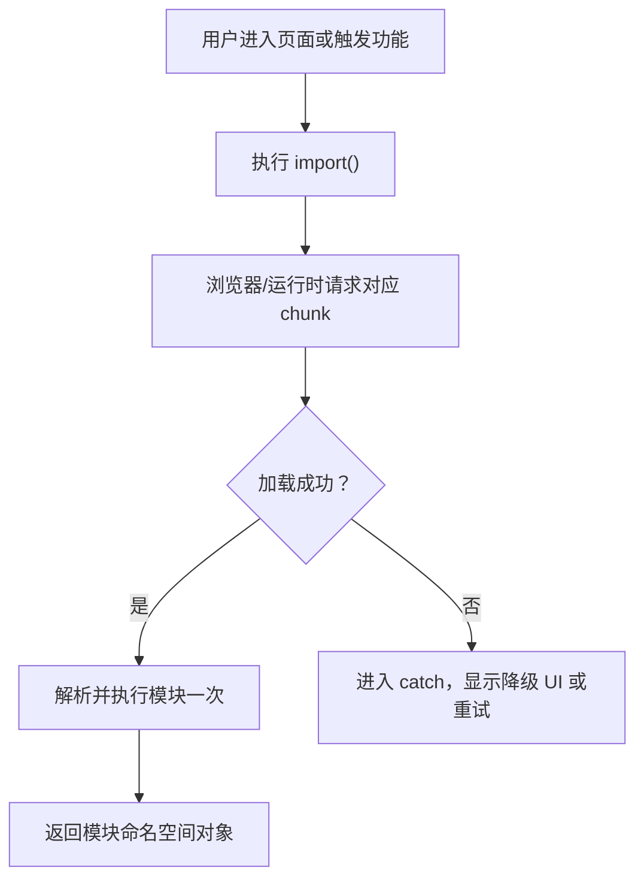

# 143. [中级] 动态 import() 的用法和应用场景

> 来源：`docs/javascript/js_interview_questions_part_3.md`

## 问题本质解读

动态 `import()` 的核心不是“另一种引入模块的写法”，而是在运行时按需加载模块。它返回一个 Promise，常用于路由懒加载、组件懒加载、条件能力加载和错误降级。

一句话答法：静态 `import` 适合启动时必须加载的依赖，动态 `import()` 适合用户触发、条件满足或页面进入后才需要加载的依赖。

## 问题意图

这道题主要考察三件事：

1. 是否知道 `import()` 返回 Promise，而不是同步拿到模块。
2. 是否能把它和代码分割、懒加载、首屏性能联系起来。
3. 是否知道动态路径、加载失败、重复加载和类型提示这些工程边界。

## 考察范围

- `import()` 的返回值和模块命名空间对象。
- 默认导出、命名导出的取值方式。
- 动态导入与静态 `import` 的执行时机差异。
- 构建工具的 chunk 拆分、预加载和动态路径限制。
- 懒加载失败、重复点击、降级兜底和加载态处理。
- Vue/React 路由、弹窗、图表、编辑器等前端场景。

## 技术错误纠正

- 原始材料里的 `cosnt` 应改为 `const`。
- `import()` 不是只能写固定字符串，也可以用表达式；但表达式路径会影响构建工具能否静态枚举 chunk。
- 动态导入不会让模块“每次都重新执行”。同一个模块加载成功后会被模块系统缓存，后续导入通常复用同一个模块实例。
- `const module = await import('./xxx.js')` 得到的是模块命名空间对象，默认导出要取 `module.default`。

## 知识点系统梳理

### 基本语法

```js
const module = await import('./user-panel.js')

module.default()
module.loadUser()
```

动态 `import()` 的结果是模块命名空间对象：

| 导出方式 | 动态导入取值 |
| --- | --- |
| `export default Component` | `(await import('./x.js')).default` |
| `export const foo = 1` | `(await import('./x.js')).foo` |
| `export function run() {}` | `(await import('./x.js')).run` |

### 和静态 import 的区别

| 对比项 | 静态 `import` | 动态 `import()` |
| --- | --- | --- |
| 执行时机 | 模块初始化阶段 | 代码运行到该语句时 |
| 返回值 | 绑定导入标识符 | Promise |
| 路径 | 必须是静态字符串 | 可以是表达式，但构建工具有约束 |
| 典型用途 | 基础依赖、公共模块 | 懒加载、条件加载、按需加载 |
| 错误处理 | 加载失败通常表现为模块加载错误 | 可用 `try/catch` 或 `.catch()` 降级 |

### 运行流程



### 关键边界

- 动态路径不要完全不可预测，例如 `import(userInput)` 通常无法被构建工具可靠拆分。
- 懒加载模块要有加载态、错误态和重试入口，否则网络失败时页面会空白。
- 适合拆“大且低频”的模块，不适合把每个小函数都拆成 chunk。
- SSR 场景要确认目标模块是否依赖 `window`、`document` 等浏览器对象。

## 实战应用举例

### 示例 1：点击后加载重型图表模块

这个例子证明：图表库不需要进入页面时立刻加载，可以在用户打开图表面板时再加载，并处理加载失败。

```js
let chartModulePromise

async function openChartPanel(container, data) {
  container.textContent = '图表加载中...'

  try {
    chartModulePromise ||= import('./chart-panel.js')
    const { renderChart } = await chartModulePromise
    container.textContent = ''
    renderChart(container, data)
  } catch (error) {
    container.textContent = '图表加载失败，请稍后重试'
    console.error('load chart-panel failed:', error)
  }
}
```

边界说明：

- `chartModulePromise ||=` 避免用户连续点击时发起多次加载。
- `catch` 是必须的；chunk 可能因为网络、部署版本不一致或缓存失效而加载失败。
- 如果图表是首屏关键内容，就不适合懒加载。

### 示例 2：按权限加载管理后台能力

```js
async function loadAdminTools(user) {
  if (!user.permissions.includes('admin')) {
    return null
  }

  const { createAdminTools } = await import('./admin-tools.js')
  return createAdminTools(user)
}
```

这个例子适合权限差异明显的能力：普通用户永远不会用到后台管理模块，就不必让它进入首屏包。

## 使用场景说明和对比

| 场景 | 是否适合 `import()` | 原因 |
| --- | --- | --- |
| 路由页面懒加载 | 适合 | 页面进入后才需要对应组件 |
| 大型弹窗、图表、富文本编辑器 | 适合 | 体积大、使用频率低 |
| 按权限加载后台能力 | 适合 | 不同用户需要不同能力 |
| 基础工具函数，如 `formatDate` | 不适合 | 体积小，拆 chunk 的请求成本可能更高 |
| 首屏必须展示的核心组件 | 通常不适合 | 懒加载会拖慢关键路径 |
| 用户输入直接拼接路径 | 不适合 | 构建不可控，也可能带来安全和可维护性问题 |

和其他方案的关系：

| 方案 | 解决什么问题 | 和 `import()` 的关系 |
| --- | --- | --- |
| 静态 `import` | 启动时固定依赖 | 默认选择，简单稳定 |
| 动态 `import()` | 运行时按需加载 | 用于拆包和条件加载 |
| 预加载/预取 | 提前请求未来可能用到的 chunk | 常和动态导入配合 |
| CDN 外链脚本 | 加载非模块化第三方资源 | 不等价，依赖全局变量和加载顺序 |

## 易错点提示

- `await import('./x.js')` 得到的不是默认导出本身，而是模块对象。
- 动态导入失败是异步错误，`try/catch` 要包住 `await import()`。
- 动态导入不是性能银弹；拆得太碎会增加请求数和调度开销。
- 变量路径要让构建工具能枚举，例如限制在固定目录和固定后缀。
- 懒加载组件要设计 loading、error、retry，否则用户只会看到空白。
- 部署时如果旧 HTML 引用新旧 chunk 混杂，动态导入可能报 chunk load error。

## 记忆要点总结

- `import()` 返回 Promise，适合“晚点再加载”。
- 默认导出取 `.default`，命名导出按属性取。
- 拆包目标应是“大、低频、非首屏”的模块。
- 动态路径能写，但不能失控。
- 工程上必须处理加载态、失败态和重复触发。

## 延伸问题

1. 动态 `import()` 和静态 `import` 在执行时机上有什么区别？
2. 为什么动态路径会影响构建工具的 tree-shaking 和 chunk 拆分？
3. Vue Router 或 React Router 的路由懒加载如何处理加载失败？
4. 什么情况下不应该做组件懒加载？
5. chunk load error 通常由哪些部署或缓存问题引起？

## 可能类似的问题及简要参考答案

**Q：`import()` 返回什么？**  
A：返回 Promise，resolve 后得到模块命名空间对象；默认导出在 `.default` 上。

**Q：动态导入会重复执行模块代码吗？**  
A：同一个模块通常只初始化一次，后续导入复用缓存后的模块实例。

**Q：动态导入如何优化首屏？**  
A：把非首屏、低频、大体积模块拆成独立 chunk，首屏只加载必要代码。

**Q：为什么不能随便写 `import(path)`？**  
A：构建工具需要在构建期推断可能的模块集合，完全不可控的路径会导致打包失败或打出过大的上下文包。

## 辅助记忆总结

记成一句话：`import()` 是“运行到这里再拉包”。回答时按“返回 Promise -> 拿模块对象 -> 拆大且低频的包 -> 处理失败和重复触发”展开。
