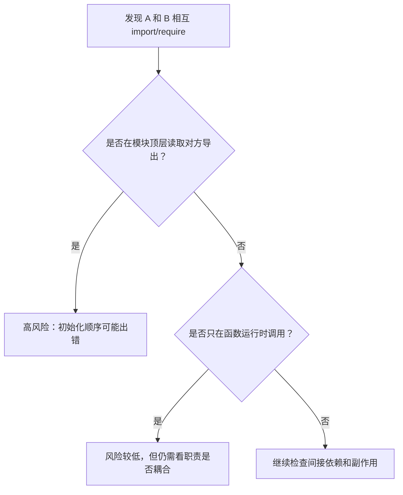

# 144. [高级] 模块的循环依赖问题如何解决？

> 来源：`docs/javascript/js_interview_questions_part_3.md`

## 问题本质解读

循环依赖指模块之间形成依赖环，例如 A 导入 B，B 又导入 A。真正要回答的不是“能不能循环依赖”，而是：模块系统如何处理初始化顺序，以及工程上怎样拆掉这个依赖环。

一句话答法：循环依赖优先通过调整模块职责消除；短期可用延迟调用、依赖注入或事件解耦规避初始化时读取未就绪导出。

## 问题意图

这道题主要考察：

1. 是否理解 ESM 和 CommonJS 对循环依赖的处理差异。
2. 是否知道循环依赖的风险来自“初始化阶段读取未完成的导出”。
3. 是否能给出工程解法，而不是只说“避免循环依赖”。

## 考察范围

- 直接循环依赖和间接循环依赖。
- ESM 的 live binding、TDZ 和初始化顺序。
- CommonJS 的部分导出缓存。
- 初始化阶段读取导出、运行阶段调用导出的差异。
- 依赖注入、事件发布订阅、抽公共模块、延迟导入等解法。
- 构建工具循环依赖提示和代码组织边界。

## 技术错误纠正

原始材料把“ES6 模块使用 TDZ 处理循环依赖”说得过于简化。更准确的说法是：ESM 导出是 live binding，模块会先建立绑定再执行代码；如果在依赖模块初始化完成前访问处于 TDZ 的绑定，就会报错。

CommonJS 不是“解决了循环依赖”，而是通过 `require` 缓存返回当前已经赋值的 `exports`，因此可能拿到不完整对象或 `undefined`。

## 知识点系统梳理

### 循环依赖类型

| 类型 | 例子 | 风险 |
| --- | --- | --- |
| 直接循环 | A -> B -> A | 最容易在初始化阶段出错 |
| 间接循环 | A -> B -> C -> A | 更隐蔽，常在多人维护后出现 |
| 运行时循环调用 | A 的函数调用 B，B 的函数再调用 A | 不一定是模块加载问题，但可能递归失控 |

### ESM 和 CommonJS 的差异

| 对比项 | ESM | CommonJS |
| --- | --- | --- |
| 导出模型 | live binding | `module.exports` 对象 |
| 加载阶段 | 先解析依赖图，再实例化和执行 | 执行到 `require` 时同步加载 |
| 循环依赖表现 | 可能触发 TDZ 或读取未初始化绑定 | 可能拿到部分导出对象 |
| 典型报错 | `Cannot access 'x' before initialization` | `undefined`、函数不存在、状态不完整 |

### 判断是否危险



### 常见解决策略

| 解法 | 适合场景 | 注意点 |
| --- | --- | --- |
| 抽公共模块 | A/B 共享常量、类型、纯函数 | 最优先，改动通常最干净 |
| 依赖注入 | 两个服务需要互相协作 | 在组合层装配依赖，不在模块顶层互相 new |
| 事件驱动 | 一个模块只需要通知另一个模块 | 避免事件名失控，注意取消订阅 |
| 延迟导入 | 低频功能、插件、兜底方案 | 解决加载时机，不一定解决职责问题 |
| 合并模块 | 两个模块本来就是同一职责 | 适合过度拆分导致的循环 |

## 实战应用举例

### 示例 1：把共享能力抽到第三个模块

问题代码：

```js
// user-service.js
import { writeAuditLog } from './audit-service.js'

export function createUser(name) {
  const user = { id: Date.now(), name }
  writeAuditLog('user_created', user.id)
  return user
}

// audit-service.js
import { findUser } from './user-service.js'

export function writeAuditLog(action, userId) {
  const user = findUser(userId)
  console.log(action, user?.name)
}
```

更稳的写法：把共享查询放到仓储层，两个服务都依赖更底层模块。

```js
// user-repository.js
const users = new Map()

export function saveUser(user) {
  users.set(user.id, user)
}

export function findUser(id) {
  return users.get(id)
}

// user-service.js
import { saveUser } from './user-repository.js'

export function createUser(name) {
  const user = { id: Date.now(), name }
  saveUser(user)
  return user
}

// audit-service.js
import { findUser } from './user-repository.js'

export function writeAuditLog(action, userId) {
  const user = findUser(userId)
  console.log(action, user?.name)
}
```

这个例子证明：真正的修复通常不是换一种导入语法，而是让依赖方向从“互相依赖”变成“共同依赖更底层模块”。

### 示例 2：用组合层做依赖注入

```js
// user-service.js
export function createUserService({ auditService }) {
  return {
    createUser(name) {
      const user = { id: Date.now(), name }
      auditService.write('user_created', user.id)
      return user
    },
  }
}

// audit-service.js
export function createAuditService() {
  return {
    write(action, userId) {
      console.log(action, userId)
    },
  }
}

// app-services.js
import { createAuditService } from './audit-service.js'
import { createUserService } from './user-service.js'

const auditService = createAuditService()
const userService = createUserService({ auditService })

export { auditService, userService }
```

这个例子适合业务服务互相协作的场景：模块文件不互相导入，依赖关系集中在组合层。

## 使用场景说明和对比

| 处理方式 | 适用 | 不适用 |
| --- | --- | --- |
| 抽公共模块 | 共享常量、工具函数、仓储能力 | 公共模块反过来依赖业务模块 |
| 依赖注入 | 服务之间需要协作但不应互相构造 | 小脚本或简单工具函数，过度设计 |
| 事件驱动 | 日志、埋点、通知、插件钩子 | 强依赖返回值的同步流程 |
| 延迟导入 | 低频路径、避免顶层初始化读取 | 核心职责混乱的长期方案 |
| 合并模块 | A/B 频繁互调且属于同一概念 | 模块已经职责清晰，只是偶发调用 |

调试线索：

| 现象 | 可能原因 | 检查点 |
| --- | --- | --- |
| `Cannot access before initialization` | ESM 顶层读取未初始化绑定 | 查顶层变量、类继承、立即执行函数 |
| 拿到 `undefined` | CommonJS 部分导出 | 查 `require` 顺序和 `module.exports` 赋值时机 |
| 构建工具提示 circular dependency | 间接依赖环 | 用依赖图定位 A -> B -> C -> A |
| 单测单独跑通过，整体跑失败 | 模块缓存和初始化顺序差异 | 查测试间共享状态和副作用模块 |

## 易错点提示

- 不要把“ESM 支持循环依赖”理解成“循环依赖没有风险”。
- 风险最高的是模块顶层执行代码时读取对方导出。
- `export default new Service()` 容易在循环依赖里制造初始化顺序问题。
- CommonJS 中 `exports.foo = foo` 和 `module.exports = { foo }` 的赋值时机不同，循环依赖下表现可能不同。
- 延迟 `import()` 只能推迟加载，不会自动修复错误的模块职责。
- 类型依赖和运行时依赖要分开看；TypeScript 中能用 `import type` 的地方不要引入运行时代码。

## 记忆要点总结

- 循环依赖的核心风险是“初始化时读到没准备好的东西”。
- ESM 是 live binding，CommonJS 是部分导出对象。
- 优先抽公共模块，其次依赖注入或事件解耦。
- 延迟导入是止血方案，不是架构修复。
- 顶层副作用越多，循环依赖越危险。

## 延伸问题

1. ESM 循环依赖为什么可能触发 TDZ？
2. CommonJS 循环依赖为什么会拿到不完整的 `exports`？
3. 如何用依赖图定位间接循环依赖？
4. `import type` 能解决什么类型的循环依赖？
5. 为什么 `export default new XxxService()` 在大型项目里容易出问题？

## 可能类似的问题及简要参考答案

**Q：循环依赖一定会报错吗？**  
A：不一定。只在运行时调用对方函数可能暂时没问题；在模块顶层读取未初始化导出风险最高。

**Q：ESM 和 CommonJS 循环依赖最大的区别是什么？**  
A：ESM 导出是 live binding，可能触发 TDZ；CommonJS 返回当前缓存的 `exports` 对象，可能是不完整对象。

**Q：项目里发现循环依赖，第一步怎么做？**  
A：先画出依赖环，再看共享逻辑能否抽到更底层模块；不要先用动态导入掩盖职责问题。

**Q：什么时候可以接受循环依赖？**  
A：非常少。只有确认没有顶层读取、没有初始化副作用、且短期重构成本过高时，才可以带注释临时保留。

## 辅助记忆总结

记成一句话：循环依赖不是“导入语法问题”，而是“依赖方向问题”。回答时按“识别依赖环 -> 判断初始化风险 -> 抽公共模块/注入/事件解耦 -> 必要时延迟导入”展开。
