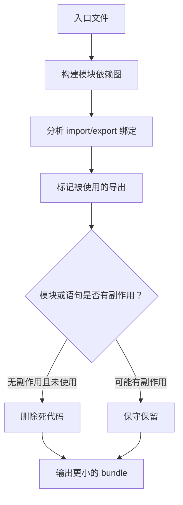

# 145. [中级] Tree-shaking 的原理是什么？

> 来源：`docs/javascript/js_interview_questions_part_3.md`

## 问题本质解读

Tree-shaking 是构建工具基于模块依赖关系移除未使用导出的优化过程。它不是把代码“注释掉”，而是在打包阶段做静态分析、标记使用到的导出，再交给压缩器删除死代码。

一句话答法：Tree-shaking 能生效的关键是 ESM 静态结构和可判断的副作用边界。

## 问题意图

这道题主要考察：

1. 是否理解为什么 ESM 比 CommonJS 更适合 tree-shaking。
2. 是否知道“未被引用”和“可安全删除”不是同一件事。
3. 是否能写出对 tree-shaking 友好的业务代码和库代码。

## 考察范围

- ESM 的静态 `import/export` 结构。
- 依赖图、used exports、dead code elimination。
- 副作用代码和 `package.json` 的 `sideEffects` 字段。
- 默认导出对象、命名导出、命名空间导入对优化的影响。
- Babel/TypeScript 是否保留 ESM。
- Webpack、Rollup、Vite 等构建工具的生产模式优化。

## 技术错误纠正

- Tree-shaking 不是“注释未使用代码”，而是构建产物中不再包含可删除的死代码。
- “没有引用”不代表一定能删；如果模块顶层有副作用，构建工具必须保守保留。
- 只写 `import/export` 还不够，还要避免把 ESM 转成 CommonJS，并正确声明副作用。
- `sideEffects: false` 不能乱写；如果包里有全局 CSS、polyfill、注册逻辑，错误声明会导致功能被删。

## 知识点系统梳理

### 基本流程



### 为什么 ESM 更适合

ESM 的导入导出必须在顶层声明，构建工具能在不执行代码的情况下知道依赖关系。

| 写法 | Tree-shaking 友好度 | 原因 |
| --- | --- | --- |
| `export function add() {}` | 高 | 命名导出可精确追踪 |
| `import { add } from './math.js'` | 高 | 只声明需要的绑定 |
| `export default { add, sub }` | 低 | 对象属性是否被用到更难静态判断 |
| `const mod = require(name)` | 低 | 运行时才能知道加载哪个模块 |

### “未使用”与“可删除”的区别

```js
export function used() {
  return 'used'
}

export function unused() {
  return 'unused'
}

console.log('module loaded')
```

即使 `unused` 没被引用，顶层 `console.log` 仍是副作用，构建工具不能简单删除整个模块。

### 副作用的常见来源

- 顶层修改全局对象：`window.xxx = ...`。
- 顶层执行注册逻辑：组件库自动注册、插件自动安装。
- 引入 CSS：`import './style.css'`。
- polyfill：修改内置原型或全局 API。
- 顶层发请求、读写 localStorage、埋点上报。

## 实战应用举例

### 示例 1：工具函数库的友好写法

```js
// math.js
export function add(a, b) {
  return a + b
}

export function multiply(a, b) {
  return a * b
}

export function formatCurrency(value) {
  return `¥${value.toFixed(2)}`
}

// main.js
import { add } from './math.js'

console.log(add(1, 2))
```

这个例子证明：命名导出让构建工具能明确知道 `multiply` 和 `formatCurrency` 没被入口使用。

边界：如果 `math.js` 顶层还有 `console.log()` 或全局注册逻辑，模块整体可能仍要保留副作用代码。

### 示例 2：库入口避免默认导出大对象

不友好的写法：

```js
// utils.js
function debounce() {}
function throttle() {}
function deepClone() {}

export default {
  debounce,
  throttle,
  deepClone,
}
```

更友好的写法：

```js
// utils.js
export function debounce() {}
export function throttle() {}
export function deepClone() {}

// app.js
import { debounce } from './utils.js'
```

这个例子证明：对库代码来说，命名导出比“默认导出一个工具对象”更利于按需删除。

### 示例 3：谨慎声明 sideEffects

```json
{
  "name": "ui-kit",
  "sideEffects": [
    "**/*.css",
    "./src/polyfill.js"
  ]
}
```

这个配置表示：大部分 JS 可按无副作用处理，但 CSS 和 polyfill 不能被误删。

## 使用场景说明和对比

| 场景 | 是否有利于 tree-shaking | 建议 |
| --- | --- | --- |
| 业务模块使用命名导出 | 有利 | 保持 ESM，不要编译成 CommonJS |
| 工具库默认导出大对象 | 不利 | 改成命名导出 |
| 顶层自动注册组件 | 不利 | 改成显式 `install()` 或标记副作用 |
| 引入 CSS 或 polyfill | 需要保守处理 | 在 `sideEffects` 中保留 |
| 动态 `require()` | 不利 | 改成静态 `import` 或固定映射表 |
| 只在生产构建验证体积 | 必要 | 开发模式通常不会完整压缩删除 |

与相近概念对比：

| 概念 | 解决什么 | 和 tree-shaking 的关系 |
| --- | --- | --- |
| Code splitting | 把代码拆成多个 chunk | 解决加载时机，不等于删除死代码 |
| Tree-shaking | 删除未使用导出 | 解决包里不该出现的代码 |
| Minification | 压缩变量名、删除空白、简化表达式 | 常负责最终删除被标记的死代码 |
| Lazy loading | 运行时再加载模块 | 常依赖 code splitting，可和 tree-shaking 同时存在 |

## 易错点提示

- 开发模式包体积不能证明 tree-shaking 是否最终生效，要看生产构建。
- `import * as utils from './utils.js'` 后大量动态取属性，会降低静态分析效果。
- Babel 如果把 ESM 转成 CommonJS，tree-shaking 会明显受影响。
- `sideEffects: false` 写错会删掉 CSS、polyfill、全局注册等必要副作用。
- `lodash` 和 `lodash-es` 的 tree-shaking 表现不同，ESM 版本更友好。
- 只引用类型时，TypeScript 应使用 `import type`，避免引入运行时代码。

## 记忆要点总结

- Tree-shaking = 静态分析导入导出 + 删除未使用且无副作用的代码。
- ESM 的静态结构是基础，CommonJS 更难精确分析。
- “没用到”不等于“能删掉”，副作用决定能否安全删除。
- 命名导出通常比默认导出大对象更友好。
- 生产构建、压缩器和 `sideEffects` 配置会共同影响最终结果。

## 延伸问题

1. 为什么 ESM 比 CommonJS 更适合 tree-shaking？
2. `sideEffects: false` 写错会造成什么问题？
3. Tree-shaking 和 code splitting 有什么区别？
4. 为什么默认导出一个工具对象会影响 tree-shaking？
5. 如何验证某个依赖是否被成功 tree-shaking？

## 可能类似的问题及简要参考答案

**Q：Tree-shaking 的前提是什么？**  
A：使用可静态分析的 ESM，并且未使用代码没有必须保留的副作用。

**Q：Tree-shaking 和懒加载有什么区别？**  
A：Tree-shaking 删除无用代码；懒加载改变代码加载时机。一个是删，一个是晚点加载。

**Q：为什么 `sideEffects` 会影响构建结果？**  
A：它告诉构建工具哪些文件导入后可能产生副作用；无副作用文件中未使用导出可以更大胆删除。

**Q：业务代码怎么写更利于 tree-shaking？**  
A：优先 ESM 命名导出，避免顶层副作用，避免动态 `require`，构建时保留 ESM 到打包阶段。

## 辅助记忆总结

记成一句话：Tree-shaking 是“摇掉没用且没副作用的导出”。回答时按“ESM 静态结构 -> 标记使用导出 -> 判断副作用 -> 生产构建删除”展开。
