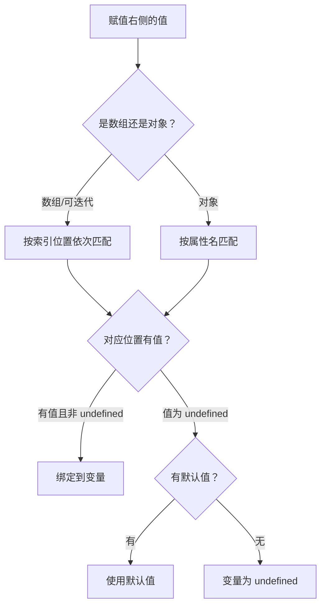

# 062. [初级]** 什么是解构赋值？基本语法是什么？

> 来源：`docs/javascript/js_interview_questions_part_2.md`

## 问题本质解读

解构赋值是一种从数组或对象中按结构提取值并绑定到变量的语法糖，数组按位置匹配，对象按属性名匹配。

一句话答法：解构赋值用 `[]` 按索引提取数组元素，用 `{}` 按属性名提取对象属性，支持默认值、重命名、嵌套和 rest 收集。

## 问题意图

这道题主要考察三件事：

1. 是否清楚数组解构和对象解构的匹配规则差异（位置 vs 属性名）。
2. 是否知道默认值的触发条件是 `undefined`，而不是所有假值。
3. 是否能在函数参数、模块导入、API 响应处理等实际场景中正确使用解构。

## 考察范围

- 数组解构 vs 对象解构的匹配机制差异。
- 嵌套解构和变量重命名语法。
- 默认值触发条件（仅 `undefined`）。
- rest pattern（`...rest`）的位置规则。
- 解构在函数参数中的应用。
- 解构失败时的行为（得到 `undefined`，不报错）。

## 技术错误纠正

- 对象解构的 `{ a: newName }` 中，冒号左边是属性名（用于匹配），右边是变量名（用于绑定），容易和对象字面量的"键: 值"搞混。
- 默认值只在值为 `undefined` 时生效，`null`、`0`、`''`、`false` 都不会触发默认值。
- 解构目标如果是 `null` 或 `undefined`，会直接抛 TypeError，不是静默返回 `undefined`。

## 知识点系统梳理

### 基本语法

```js
// 数组解构：按位置匹配
const [a, b, c] = [1, 2, 3]

// 对象解构：按属性名匹配
const { name, age } = { name: 'Alice', age: 25 }
```

### 数组解构 vs 对象解构

| 对比项 | 数组解构 | 对象解构 |
| --- | --- | --- |
| 匹配规则 | 按索引位置 | 按属性名 |
| 语法符号 | `[]` | `{}` |
| 跳过元素 | `[, , third]` 用逗号占位 | 不需要，直接写目标属性名 |
| 重命名 | 不需要，变量名自由定义 | `{ key: newName }` |
| 顺序是否重要 | 是 | 否 |
| 底层协议 | 可迭代协议（Iterator） | 属性访问 |

### 默认值、重命名和嵌套

```js
// 默认值：仅 undefined 触发
const { host = 'localhost', port = 3000 } = { port: undefined }
// host → 'localhost', port → 3000（undefined 触发默认值）

const { enabled = true } = { enabled: false }
// enabled → false（false 不触发默认值）

// 重命名 + 默认值
const { name: userName = 'anonymous' } = {}
// userName → 'anonymous'

// 嵌套解构
const { data: { users } } = { data: { users: ['a', 'b'] } }
// users → ['a', 'b']
```

### rest pattern

```js
// 数组 rest：必须在最后
const [first, ...others] = [1, 2, 3, 4]
// first → 1, others → [2, 3, 4]

// 对象 rest：收集剩余属性
const { id, ...rest } = { id: 1, name: 'x', age: 20 }
// id → 1, rest → { name: 'x', age: 20 }
```

### 解构流程



## 实战应用举例

### 示例 1：函数参数解构与防御性默认值

这个例子证明：函数参数解构可以同时完成参数提取和默认值设置，但必须处理整个参数对象为 `undefined` 的情况。

```js
function createConfig({ host = 'localhost', port = 3000, ssl = false } = {}) {
  return { host, port, protocol: ssl ? 'https' : 'http' }
}

createConfig({ port: 8080 })
// → { host: 'localhost', port: 8080, protocol: 'http' }

createConfig()
// → { host: 'localhost', port: 3000, protocol: 'http' }

createConfig({ ssl: true, port: 443 })
// → { host: 'localhost', port: 443, protocol: 'https' }
```

边界说明：

- 末尾的 `= {}` 是关键：没有它，`createConfig()` 无参调用会抛 TypeError（对 `undefined` 解构）。
- `null` 不会触发 `= {}`，`createConfig(null)` 仍会报错。
- 属性顺序不影响匹配结果。

### 示例 2：API 响应提取与变量交换

```js
// 从嵌套响应中提取数据
const response = {
  status: 200,
  data: {
    users: [
      { id: 1, name: 'Alice', role: 'admin' },
      { id: 2, name: 'Bob', role: 'user' },
    ],
    total: 2,
  },
}

const { status, data: { users, total } } = response
// status → 200, users → [{...}, {...}], total → 2
// 注意：data 本身没有被声明为变量

// 变量交换（数组解构经典用法）
let x = 1, y = 2
;[x, y] = [y, x]
// x → 2, y → 1
```

边界说明：

- 嵌套解构中 `data:` 只是路径，不会创建 `data` 变量。如果同时需要 `data` 本身，要单独解构一次。
- 变量交换前的分号不能省略，否则上一行末尾可能和 `[` 连接导致解析错误。

## 使用场景说明和对比

| 场景 | 是否适合解构 | 原因 |
| --- | --- | --- |
| 函数参数提取配置项 | 适合 | 参数含义一目了然，支持默认值 |
| 模块导入命名导出 | 适合 | `import { ref, computed } from 'vue'` 本质就是解构 |
| 交换两个变量 | 适合 | `[a, b] = [b, a]` 比临时变量更简洁 |
| 需要保留原始对象引用 | 不适合 | 解构创建新变量，修改变量不影响原对象的基本类型属性 |
| 解构层级超过 3 层 | 不适合 | 可读性急剧下降，不如分步提取 |
| 数据结构不稳定、字段可能不存在 | 谨慎使用 | 中间层为 `undefined` 会抛错，需配合可选链或提前判空 |

## 易错点提示

- `{ a: b }` 是把属性 `a` 的值赋给变量 `b`，不是把 `b` 赋给 `a`。方向和对象字面量相反。
- 默认值只对 `undefined` 生效：`const { x = 1 } = { x: null }` 结果 `x` 是 `null`，不是 `1`。
- 已声明变量做对象解构要加括号：`({ a } = obj)` ，不加括号 `{ a } = obj` 会被解析为块语句。
- rest 元素必须在最后：`const [..a, b] = arr` 语法错误。
- 嵌套解构时中间层为 `null` 或 `undefined` 会抛 TypeError，不会静默跳过。
- 数组解构依赖迭代协议，对普通对象使用 `[]` 解构会报 `not iterable` 错误。

## 记忆要点总结

- 数组按位置，对象按属性名。
- 默认值只在 `undefined` 时触发，`null` 不触发。
- 重命名语法：`{ 原属性名: 新变量名 }`。
- rest（`...`）必须在最后一个位置。
- 函数参数解构末尾加 `= {}` 防止无参调用报错。

## 延伸问题

1. 解构赋值的默认值可以是表达式吗？什么时候求值？
2. 对象解构在 `for...of` 循环中如何使用？
3. 解构赋值和 `Object.assign` 有什么区别？
4. TypeScript 中解构赋值如何标注类型？
5. 解构赋值在性能上和逐个属性访问有差异吗？

## 可能类似的问题及简要参考答案

**Q：解构赋值的默认值什么时候生效？**  
A：仅当解构得到的值为 `undefined` 时生效。`null`、`0`、`''`、`false` 都不触发默认值。

**Q：如何用解构赋值交换变量？**  
A：`[a, b] = [b, a]`。注意如果上一行没有分号，要在前面加 `;` 防止解析错误。

**Q：嵌套解构中间层不存在怎么办？**  
A：会抛 TypeError。可以先用可选链确认中间层存在，或分步解构并判空。

## 辅助记忆总结

记成一句话：解构就是"左边写结构，右边给数据，按位置或属性名对号入座"。回答时按"数组按位置 / 对象按属性名 → 默认值只认 undefined → rest 放最后 → 函数参数加 = {}"展开。
