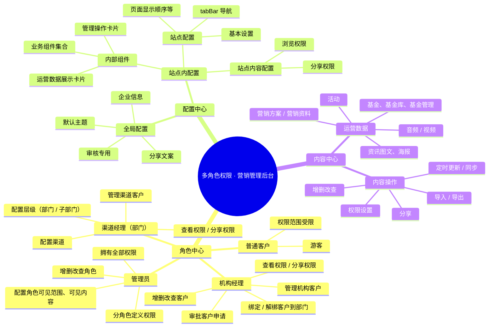

```mermaid
mindmap
  root((多角色权限 · 营销管理后台))

    角色中心
      管理员
        增删改查角色
        分角色定义权限
        拥有全部权限
        配置角色可见范围、可见内容
      渠道经理（部门）
        配置渠道
        管理渠道客户
        查看权限 / 分享权限
        配置层级（部门 / 子部门）
      机构经理
        管理机构客户
        审批客户申请
        增删改查客户
        绑定 / 解绑客户到部门
        查看权限 / 分享权限
      普通客户
        游客
        权限范围受限

    配置中心
      全局配置
        企业信息
        分享文案
        审核专用
        默认主题
      站点内配置
        内部组件
          运营数据展示卡片
          业务组件集合
          管理操作卡片
        站点配置
          基本设置
          tabBar 导航
          页面显示顺序等
        站点内容配置
          浏览权限
          分享权限

    内容中心
      运营数据
        音频 / 视频
        活动
        资讯图文、海报
        营销方案 / 营销资料
        基金、基金库、基金管理
      内容操作
        导入 / 导出
        定时更新 / 同步
        权限设置
        增删改查
        分享
```
